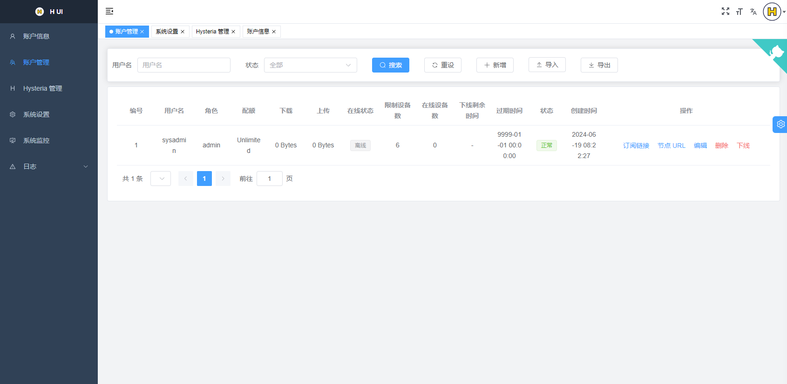

<div align="center">

<a href="https://github.com/jonssonyan/h-ui"></a>

<h1 align="center">H UI</h1>

[English](README.md) / 简体中文

Just the panel for Hysteria2

仅仅是 Hysteria2 的面板

<p>
<a href="https://www.gnu.org/licenses/gpl-3.0.html"></a>
<a href="https://github.com/jonssonyan/h-ui/stargazers"></a>
<a href="https://github.com/jonssonyan/h-ui/forks"></a>
<a href="https://github.com/jonssonyan/h-ui/releases"></a>
<a href="https://hub.docker.com/r/jonssonyan/h-ui"></a>
</p>



</div>

## 主要功能

- 轻量级、资源占用低、易于部署
- 监控系统状态和 Hysteria2 状态
- 限制用户流量、用户在线状态、强制用户下线、在线用户数、重设用户流量
- 限制用户同时在线设备数、在线设备数量
- 用户订阅链接、节点URL、导入和导出用户
- 管理 Hysteria2 配置和 Hysteria2 版本
- 更改 Web 端口、修改 Hysteria2 流量倍数
- 查看、导入和导出系统日志和 Hysteria2 日志
- 多国语言支持: English, 简体中文
- 页面适配、支持夜间模式、自定义页面主题
- 更多功能等待你发现

## 建议系统

系统: CentOS 8+/Ubuntu 20+/Debian 11+

CPU: x86_64/amd64 arm64/aarch64

内存: ≥ 256MB

## 部署

### 快速安装 (推荐)

```bash
bash <(curl -fsSL https://raw.githubusercontent.com/jonssonyan/h-ui/main/install.sh)
```

### 容器部署

1. 安装 Docker

   https://docs.docker.com/engine/install/

   ```bash
   bash <(curl -fsSL https://get.docker.com)
   ```

2. 启动容器

   ```bash
   docker pull jonssonyan/h-ui

   docker run -d --cap-add=NET_ADMIN \
     --name h-ui --restart always \
     --network=host \
     -v /h-ui/bin:/h-ui/bin \
     -v /h-ui/data:/h-ui/data \
     -v /h-ui/export:/h-ui/export \
     -v /h-ui/logs:/h-ui/logs \
     jonssonyan/h-ui
   ```

   自定义 Web 端口，默认 8081

   ```bash
   docker run -d --cap-add=NET_ADMIN \
     --name h-ui --restart always \
     --network=host \
     -v /h-ui/bin:/h-ui/bin \
     -v /h-ui/data:/h-ui/data \
     -v /h-ui/export:/h-ui/export \
     -v /h-ui/logs:/h-ui/logs \
     jonssonyan/h-ui \
     ./h-ui -p 8081
   ```

   设置时区，默认 Asia/Shanghai

   ```bash
   docker run -d --cap-add=NET_ADMIN \
     --name h-ui --restart always \
     --network=host \
     -e TZ=Asia/Shanghai \
     -v /h-ui/bin:/h-ui/bin \
     -v /h-ui/data:/h-ui/data \
     -v /h-ui/export:/h-ui/export \
     -v /h-ui/logs:/h-ui/logs \
     jonssonyan/h-ui
   ```

卸载

```bash
docker rm -f h-ui
docker rmi jonssonyan/h-ui
rm -rf /h-ui
```

### systemd

下载可执行文件: https://github.com/jonssonyan/h-ui/releases

```bash
mkdir -p /usr/local/h-ui/
curl -fsSL https://github.com/jonssonyan/h-ui/releases/latest/download/h-ui-linux-amd64 -o /usr/local/h-ui/h-ui && chmod +x /usr/local/h-ui/h-ui
curl -fsSL https://raw.githubusercontent.com/jonssonyan/h-ui/main/h-ui.service -o /etc/systemd/system/h-ui.service
# 自定义 Web 端口，默认 8081
# sed -i "s|^ExecStart=.*|ExecStart=/usr/local/h-ui/h-ui -p 8081|" "/etc/systemd/system/h-ui.service"
systemctl daemon-reload
systemctl enable h-ui
systemctl restart h-ui
```

卸载

```bash
systemctl stop h-ui
rm -rf /etc/systemd/system/h-ui.service /usr/local/h-ui/
```

## 默认安装信息

- 面板端口: 8081
- 用户名/密码: sysadmin

## 系统升级

在管理后台将用户、系统配置、Hysteria2 配置导出，重新部署最新版的 h-ui，部署完成之后在管理后台将数据导入

## 常见问题

[简体中文 > 常见问题](./docs/FAQ_ZH.md)

## 性能优化

- 定时重启服务器

    ```bash
    0 4 * * * /sbin/reboot
    ```

- 安装网络加速
    - [TCP Brutal](https://github.com/apernet/tcp-brutal) (推荐)
    - [teddysun/across#bbrsh](https://github.com/teddysun/across#bbrsh)
    - [Chikage0o0/Linux-NetSpeed](https://github.com/ylx2016/Linux-NetSpeed)
    - [ylx2016/Linux-NetSpeed](https://github.com/ylx2016/Linux-NetSpeed)

## 客户端

https://v2.hysteria.network/zh/docs/getting-started/3rd-party-apps/

## 开发

Go >= 1.20, Node.js >= 18.12.0

- frontend

   ```bash
   cd frontend
   pnpm install
   npm run dev
   ```

- backend

   ```bash
   go run main.go
   ```

## 构建

- frontend

   ```bash
   npm run build:prod
   ```

- backend

  Windows: [build.bat](build.bat)

  Mac/Linux: [build.sh](build.sh)

## 其他

联系我: https://t.me/jonssonyan_channel

如果你想在 Telegram 交流，可以看这里：https://t.me/jonssonyan_chat

你可以在 YouTube 上订阅我的频道: https://www.youtube.com/@jonssonyan

## 贡献者

在这里感谢所有为此项目做出贡献的人

<a href="https://github.com/jonssonyan/h-ui/graphs/contributors">
  
</a>

## Star History

[](https://star-history.com/#jonssonyan/h-ui&Date)

## 开源协议

[GPL-3.0](LICENSE)